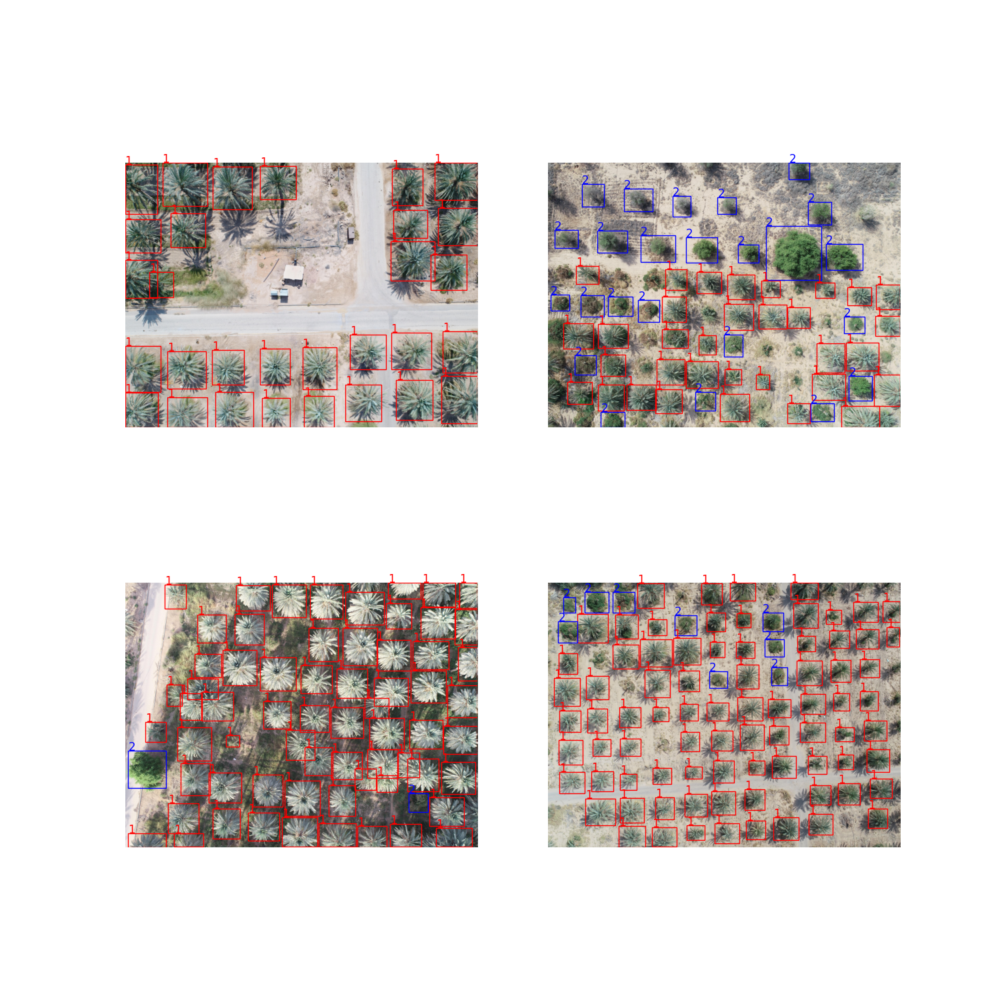
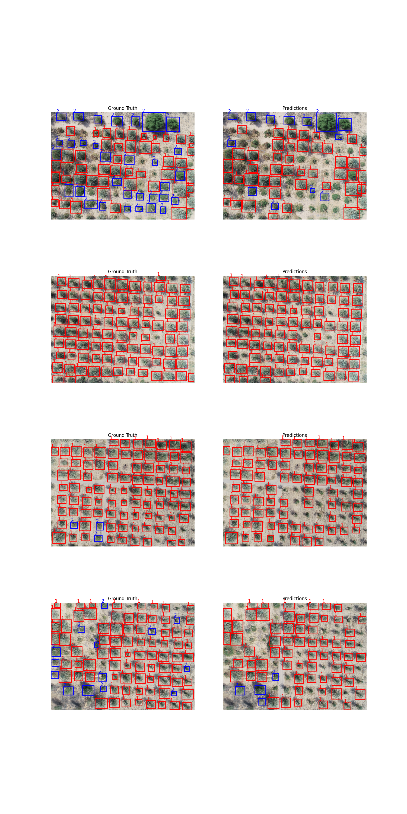

# Aya-Trees-Counting

This project focuses on detecting and classifying trees (Palm and Non-Palm) using a Faster R-CNN model. The dataset consists of annotated images with bounding boxes that identify the location and type of trees.

## Project Structure
```
.
├── model
│   ├── model.py
├── utils
│   └── __init__.py
|   ├── config.py
|   ├── data_loader.py
|   ├── logger.py
|   ├── trainer.py
|   └── visualisations.py
├── visualisations
│   ├── sample_images.png
│   ├── 50_epochs_predictions.png
│   └── 70_epochs_predictions.png
├── .gitignore
├── Dockerfile
├── entrypoint.sh
├── LICENSE
├── main.py
├── README.md
└── requirements.txt
```

- **utils/**: Utility scripts, including the trainer and dataset loader.
- **models/**: Model architecture for Faster R-CNN.
- **visualisations/**: Sample images and model predictions.
- **main.py**: Main script for training and evaluating the model.
- **Dockerfile**: Docker configuration for containerized training.
- **README.md**: Project documentation.

## Metrics Used

### Mean Average Precision (mAP)
mAP is used to evaluate the performance of the object detection model. It calculates the precision of the model at different recall levels and provides an overall metric that balances precision and recall.

### Loss
The training process optimizes several loss components:
- **Box Regression Loss**: Measures how well the predicted bounding boxes align with the ground truth.
- **Classification Loss**: Measures the accuracy of the predicted class labels.
- **Objectness Loss**: Measures the confidence of the predicted objects.
- **RPN Box Loss**: Measures the accuracy of the Region Proposal Network.


## Getting Started

### Prerequisites
- Python 3.10+
- PyTorch
- Docker (for containerized deployment)
- wandb (Weights and Biases for logging)
- GPU (for faster training)

### Training the Model

1. Clone the repository:
```bash
git clone https://github.com/maxxies/Aya-Trees-Counting.git 
```
2. Install the required packages:
```bash
pip install -r requirements.txt
```

3. Set directory paths and epochs:
```python   
DATA_DIR = "<your_data_directory>"
OUTPUT_DIR = "<output_directory>"
EPOCHS = "<number_of_epochs>"
```

4. Set up Weights and Biases for logging:
```python
import wandb
wandb.login(key="your_wandb_api_key")
```

5. Run the training script:
```python
import main

test_data, predictions, targets = main.run(DATA_DIR, OUTPUT_DIR, EPOCHS)
```

6. Evaluate the model:
```python
from utils.visualisations import plot_sample_images

plot_comparison_images(images, targets, predictions, num_images=10)
```

### Training with Docker
1. Pull the Docker image:
```bash
docker pull maxxies/palm-tree-counter:1.0
```

2. Run the Docker container:
```bash
docker run -it --gpus all \
    -v /path/to/your/data:/app/data \
    -v /path/to/save/output:/app/output \
    -e EPOCHS=50 \
    -e WANDB_API_KEY=your_wandb_api_key \
    maxxies/palm-tree-counter:1.0
```

## Model Monitoring with Weights and Biases
Weights and Biases was used to monitor the training process and log metrics. You can view the project dashboard [here](https://wandb.ai/ahiamadzormaxwell7/counting-trees).


## Evaluation

The model was trained to distinguish between:
- **1**: Palm trees
- **2**: Non-Palm trees

### Sample Images from the Dataset:
Below are some sample images from the dataset with their respective bounding boxes:



### Model Performance

1. **Training for 50 Epochs:**
   - The model was trained for 50 epochs and achieved the following results on the test set:
     - **mAP** (mean Average Precision): 0.3971
     - **mAP_50** (mean Average Precision at IoU=0.50): 0.70
    
   - Below is a visualization of the model's predictions after 50 epochs:

   

2. **Training for 70 Epochs:**
   - The model was trained for 70 epochs and achieved the following results on the test set:
     - **mAP** (mean Average Precision): 0.3972
     - **mAP_50** (mean Average Precision at IoU=0.50): 0.71
   - Below is a visualization of the model's predictions after 70 epochs:

   

Note: The model's training and validation performances can be viewed on the Weights and Biases platform indicated.

## Deployed Model
The best model was deployed on the Hugging Face Spaces platform and Streamlit for inference.
The deployed model can be accessed via the following link: [Click here](https://huggingface.co/spaces/Mawube/tree-counter).

## License
This project is licensed under the MIT License - see the [LICENSE](LICENSE) file for details.


